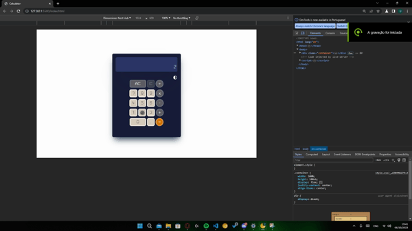

# Calculadora:
Bem-vindo ao projeto de calculadora interativa desenvolvida com HTML, CSS e JavaScript! Esta calculadora moderna e responsiva foi criada utilizando tecnologias web avançadas para proporcionar uma experiência de usuário intuitiva e amigável.

### Linguagens e Ferramentas

- HTML
- CSS
- Javascript
- Vscode
- Live Server

## Layout

### Desktop

### Mobile

### Contribua com o projeto

- Realize o Fork
- Faça as modificações necessárias
- Realize a Pull Request (PR)

### Fucionalidades do Projeto

- [x] Calcular qualquer valor;
- [x] Realizar as operações básicas da matemática;
- [x] Possuir um Display Funcional;
- [ ] Ter Modo Claro.

### Contribuidores

<a href="https://github.com/birasants">

### Autor

 
 
Sinta-se à vontade para explorar e integrar esta calculadora em seu projeto. Espero que ela torne suas operações matemáticas mais fáceis e agradáveis!

Divirta-se calculando! 🧮✨
